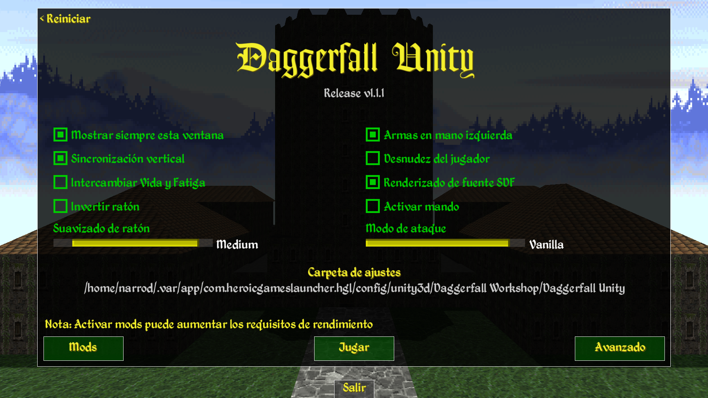
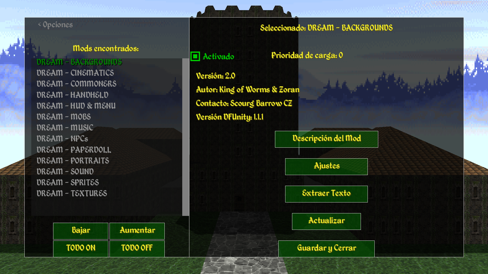
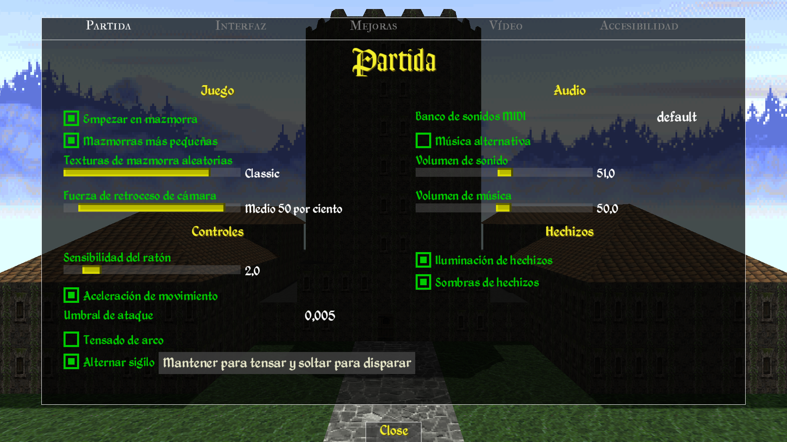

# DFUnity_SpanishTranslation

Proyecto de traducción al español para _Daggerfall Unity_. Este repositorio contiene la localización de la interfaz, objetos y configuración del sistema.

Este proyecto busca traducir todo el juego para que se pueda disfrutar de la experiencia completa en español. Nace principalmente de mi deseo personal de jugarlo en mi idioma, no de contar con habilidades lingüísticas avanzadas para una traducción perfecta. Por ello, los textos se han generado con ayuda de herramientas automáticas (Google Translate, Google Gemini versión gratuita, etc.) y luego se han revisado manualmente para evitar incoherencias.

**Importante:** Esta es una traducción pura de texto, por lo que las imágenes que contengan texto (como algunos menús del mod DREAM) permanecerán en inglés.

## 🛠 Archivos traducidos

Actualmente, el proyecto cubre los siguientes archivos de la carpeta `/Text`:

- **GameSettings.txt**: Opciones de juego, interfaz, vídeo y accesibilidad.
- **Internal_Items.csv**: Nombres de armas, armaduras y materiales (hierro, daédrico, etc.).
- **Internal_Flats.csv**: Nombres de NPCs, ciudadanos y objetos decorativos (Sprites 2D).
- **MainMenu.txt**: Configuración del lanzador inicial y selección de calidad.
- **ModSystem.txt**: Gestión de mods, prioridades y configuración de plugins.
- **DialogShortcuts.txt**: Atajos de teclado para diálogos y menús de interacción.

## 💻 Instalación

1. Localiza la carpeta de instalación de _Daggerfall Unity_.
2. Navega a `DaggerfallUnity_Data/StreamingAssets/Text/`.
3. Reemplaza los archivos existentes con los de este repositorio.

**Compatibilidad con DREAM:** Si usas el mod DREAM, ten en cuenta que algunos menús usan texturas personalizadas con texto incrustado en inglés, por lo que esas partes podrían no traducirse.

## 🚀 Estado del proyecto

- [x] Interfaz básica
- [x] Nombres de objetos y materiales
- [ ] Historia principal (carpeta `/Master Localization CSV`) - _en proceso_
- [ ] Misiones (carpeta `/Quests`) — _en proceso_
- [ ] Libros (carpeta `/Books`) — _en proceso_

## 📸 Capturas

_Menú principal con las opciones en español._

_Gestión de mods traducida._

_Configuración de juego, vídeo y accesibilidad._

## 📜 Licencia

Este proyecto se distribuye bajo la licencia **GNU GPL v3**. Puedes usarlo, modificarlo y compartirlo libremente, siempre que se mantenga esta misma libertad y se atribuya el trabajo original. Esto garantiza que la traducción permanezca abierta para toda la comunidad.

## 🤝 Contribuciones

Las contribuciones son bienvenidas. Si deseas ayudar a traducir más archivos (misiones, libros, etc.) o mejorar los existentes, abre un _issue_ o envía un _pull request_. Por favor, mantén el mismo enfoque: traducción automática + revisión manual para conservar la coherencia.
